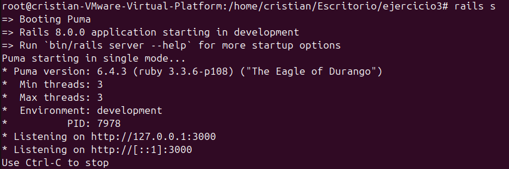
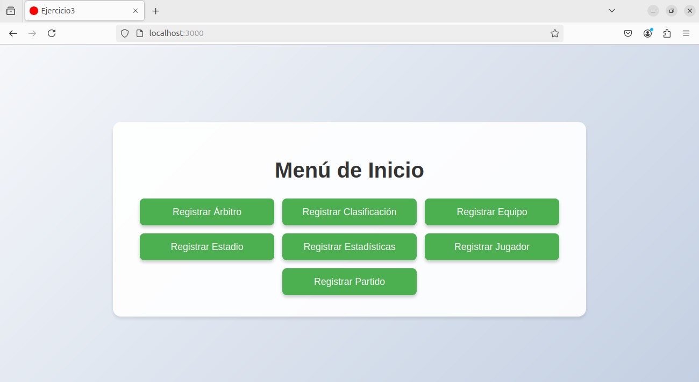
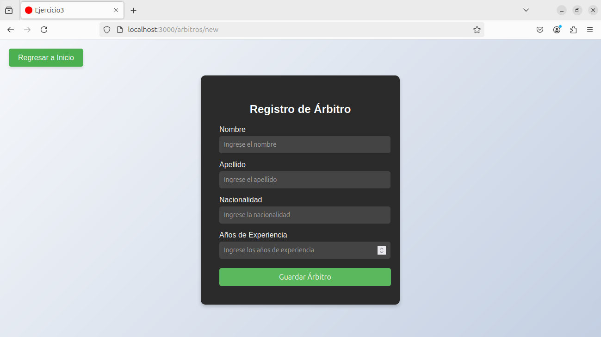
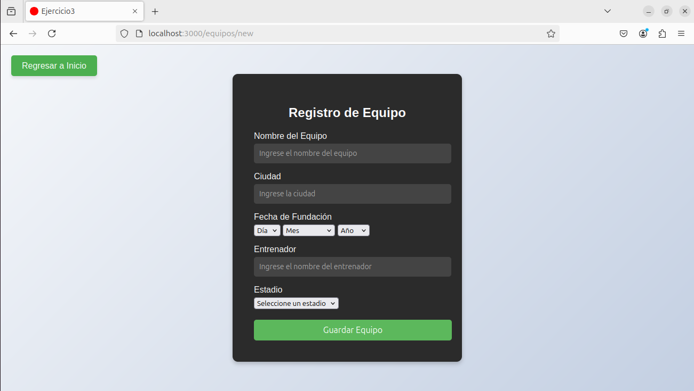

# Menú de Registro y Navegación - Rails App

Este es un programa desarrollado con **Ruby on Rails** que permite registrar información de diferentes entidades relacionadas con un sistema de gestión deportiva. Incluye funcionalidades para gestionar árbitros, equipos, jugadores, estadios, clasificaciones, estadísticas y partidos.

## Características

- Registro de **Árbitros**.
- Registro de **Clasificaciones**.
- Registro de **Equipos**.
- Registro de **Estadios**.
- Registro de **Estadísticas de Jugadores**.
- Registro de **Jugadores**.
- Registro de **Partidos**.
- Menú principal con botones de navegación para acceder a cada módulo.
- Botón "Regresar a Inicio" accesible desde todas las vistas (excepto en la página principal).
---

## Script de Base de Datos
- Se incluye el script de la base de datos, hecho en mysql, llamado 3fn.sql
---

## Capturas de Pantalla

### Rails

### Menú Principal

### Ejemplo de los Formularios

### Ejemplo de los Formularios

